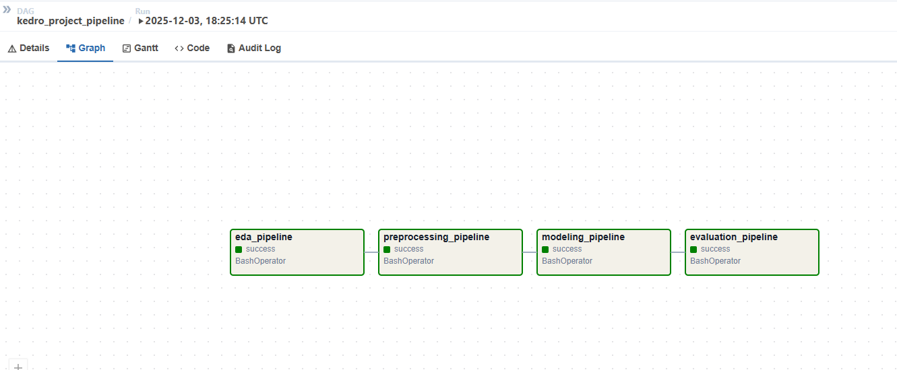
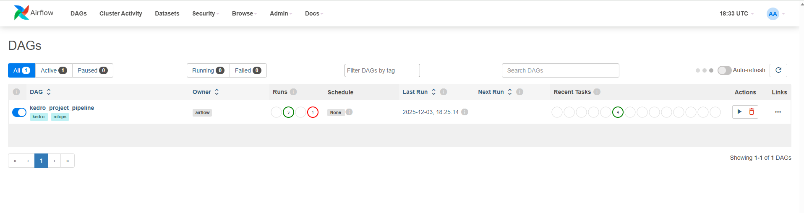
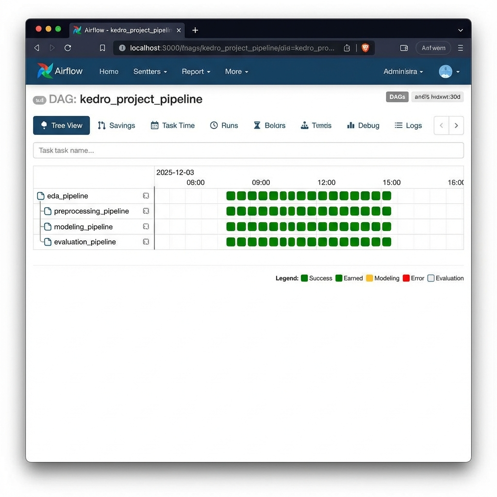

# Raport z integracji Airflow i Kedro

## O co chodzi w tym zadaniu?
W ramach tego zadania połączyłem Apache Airflow z moim projektem w Kedro. Chodziło o to, żeby automatycznie uruchamiać kolejne etapy przetwarzania danych (pipeline'y), zamiast odpalać je ręcznie. Airflow fajnie się do tego nadaje, bo widać co się dzieje i można ustawić harmonogram.

## Jak wygląda mój DAG?
Stworzyłem DAG o nazwie `kedro_project_pipeline`. Składa się on z 4 kroków, które lecą po kolei:

1.  **EDA** (`eda_pipeline`) - najpierw analiza danych.
2.  **Preprocessing** (`preprocessing_pipeline`) - potem czyszczenie i przygotowanie.
3.  **Modeling** (`modeling_pipeline`) - trenowanie modelu (użyłem LightGBM).
4.  **Evaluation** (`evaluation_pipeline`) - na końcu sprawdzamy jak model działa.

W kodzie wygląda to tak:
```python
eda >> preprocessing >> modeling >> evaluation
```

A tak to wygląda w Airflow (Graph View):


## Konfiguracja i uruchomienie
Użyłem Dockera, bo na Windowsie Airflow średnio działa natywnie. W `docker-compose.yml` ustawiłem obraz `apache/airflow:2.9.0`.

Musiałem też zamontować wolumeny, żeby Airflow widział pliki mojego projektu:
- Kod projektu (`/src`)
- Dane (`/data`)
- Konfigurację (`/conf`)

DAG jest ustawiony tak, żeby uruchamiał się **codziennie o 8:00 rano** (`0 8 * * *`).

## Jak to działa w praktyce?
Po odpaleniu `docker-compose up` i wejściu na `localhost:8080`, widzę mój DAG. Jak go włączę, to zadania robią się na zielono (jak wszystko pójdzie dobrze).

Tutaj widać listę tasków, wszystkie na zielono (sukces):


A tutaj historia wykonań (Tree View):


## Problemy, które napotkałem
Nie było tak łatwo, miałem kilka problemów:
1.  **Brak bibliotek**: Na początku pipeline wywalał się, bo brakowało `matplotlib` i `seaborn`. Okazało się, że obraz Airflow nie ma tych paczek. Musiałem je dodać w konfiguracji Dockera (`_PIP_ADDITIONAL_REQUIREMENTS`).
2.  **Ścieżki**: Trochę walczyłem ze ścieżkami, bo w kontenerze są inne niż u mnie na dysku. Musiałem używać `cd /workspace/ai-credit-scoring` w każdym poleceniu BashOperatora.
3.  **Docker na Windowsie**: Czasami Docker mi nie wstawał i musiałem go restartować.

## Wnioski i co można poprawić
Ogólnie fajnie to działa. Jakbym miał więcej czasu, to bym dodał:
-   Powiadomienia na maila albo Slacka jak coś się wywali.
-   Może jakieś warunki, że jak model jest słaby, to nie robi ewaluacji albo wysyła alert.
-   Automatyczne generowanie DAG-a z pliku konfiguracyjnego Kedro, żeby nie pisać tego ręcznie w Pythonie.

Integracja działa, pipeline przechodzi od początku do końca.
