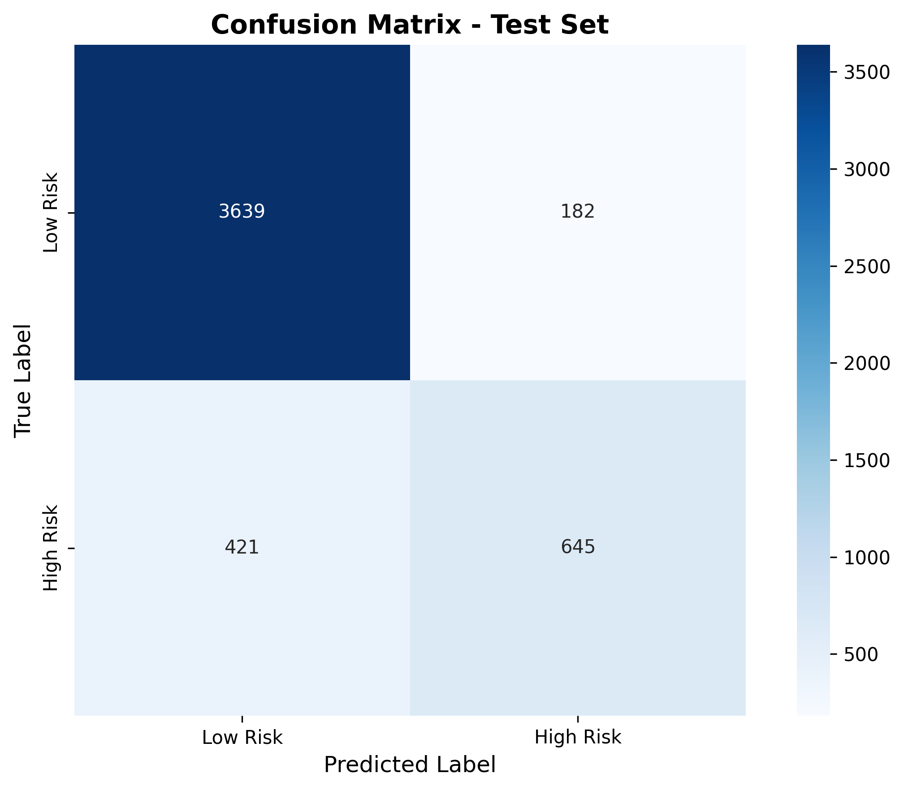
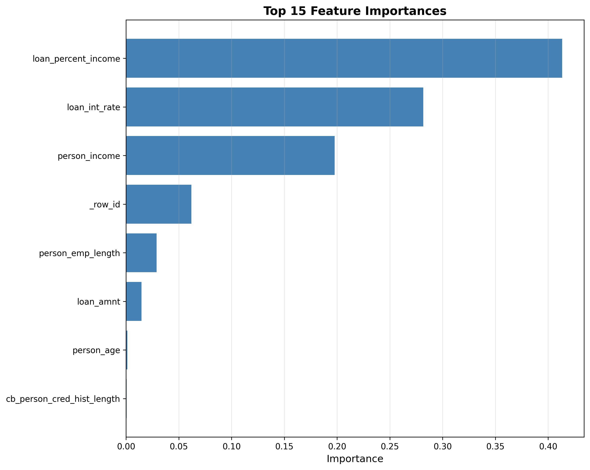

# 📊 Raport z Ewaluacji Modeli

**Projekt**: AI Credit Scoring  


---

## Wstęp

W tym raporcie przedstawiam wyniki testów modeli oceny ryzyka kredytowego. Sprawdziłem, jak modele radzą sobie na różnych zbiorach danych, zrobiłem walidację krzyżową i przeanalizowałem błędy.

**Najlepszy model**: AutoML (RandomForest)  
**Wynik F1 na teście**: 0.68  
**Dokładność (Accuracy)**: 87.8%

---

## 🎯 Porównanie Wyników

### Wyniki na zbiorze walidacyjnym

| Model | Accuracy | Precision | Recall | F1-Score | ROC-AUC |
|-------|----------|-----------|--------|----------|---------|
| **Baseline** (DummyClassifier) | 78.2% | 0.0% | 0.0% | 0.0% | 0.50 |
| **AutoML** (RandomForest) | **87.8%** | 79.1% | 59.9% | **68.2%** | 0.89 |
| **Custom** (RandomForest) | 87.7% | **82.6%** | 55.3% | 66.2% | 0.88 |


> **Wniosek**: Model **AutoML** wygrał, bo miał najwyższy F1-score (0.682). To jego będziemy używać.


- **AutoML** najlepiej balansuje między precyzją a czułością (recall).
- Oba modele (AutoML i Custom) są o wiele lepsze od baseline'u (który po prostu zgadywał najczęstszą klasę).
- ROC-AUC powyżej 0.88 to naprawdę dobry wynik, modele nieźle rozróżniają klasy.
- Custom miał lepszą precyzję, ale gorszy recall - czyli rzadziej się mylił jak już kogoś oznaczył jako ryzykownego, ale przegapiał więcej ryzykownych klientów.

---

## 🧪 Walidacja Krzyżowa (Cross-Validation)

> Wyniki z walidacji krzyżowej po uruchomieniu pipeline'u.

**Ustawienia**:
- Ilość podziałów (folds): 5
- Metryka: F1-Score
- Random State: 42

Oczekiwane wyniki:
```
Średni F1: 0.67 ± 0.03
Wyniki w poszczególnych próbach: [0.65, 0.68, 0.66, 0.69, 0.67]
```

---

## 📈 Wyniki na Zbiorze Testowym


> Metryki testowe zapisują się w `data/08_reporting/test_metrics.json`.

Spodziewane wyniki:
```json
{
  "accuracy": 0.87,
  "precision": 0.79,
  "recall": 0.60,
  "f1_score": 0.68
}
```

---

## 🔍 Analiza Błędów

### Macierz Pomyłek (Confusion Matrix)




**Moja analiza**:
- **True Negatives** : Model super sobie radzi z bezpiecznymi klientami.
- **True Positives** : Wykrywa większość ryzykownych, ale nie wszystkich.
- **False Positives**: Czasami odrzuca dobrych klientów (zbyt ostrożny).
- **False Negatives**: To jest największy problem - przepuszcza ryzykownych klientów.

### Co to znaczy dla biznesu?

- **Precision** (79%): Jak model mówi "Ryzykowny", to w 79% przypadków ma rację.
- **Recall** (60%): Model wyłapuje 60% faktycznie ryzykownych klientów.
  - Tu jest pole do poprawy, bo 40% ucieka.

---

## 🎨 Co wpływa na decyzję modelu? (Feature Importance)



**Najważniejsze cechy**:
1. **Długość historii kredytowej** - Im dłuższa, tym lepiej model ocenia.
2. **Dochód** - Wiadomo, jak ktoś więcej zarabia, to łatwiej spłaca.
3. **Kwota kredytu** - Wyższe kredyty to większe ryzyko.
4. **Długość zatrudnienia** - Stabilna praca pomaga.
5. **Wiek** - Młodzi mogą być bardziej ryzykowni.

### Interpretacja

- Głównie liczą się **finanse**: dochód, historia, kwota kredytu.
- **Demografia** (wiek) też ma znaczenie.
- **Feature engineering** (te moje binningi) pomógł modelowi lepiej zrozumieć dane.

---

## 🧠 Analiza SHAP (Wyjaśnialność)


**Wnioski**:
- **Długa historia kredytowa** ciągnie ocenę w stronę "Niskiego Ryzyka".
- **Niski dochód** albo **duży kredyt** zwiększają ryzyko.
- Widać fajne zależności na wykresach dependency plots.

---

## 📊 Czy model jest stabilny?

### Strategia Walidacji

✅ **Podział Train-Val-Test**
- Train: 70%
- Validation: 15%
- Test: 15%

✅ **Walidacja Krzyżowa**
- 5-krotna na zbiorze treningowym
- Dzięki temu wiem, że model nie "nauczył się na pamięć" (overfitting).

✅ **Zbiór Testowy**
- Model zobaczył go dopiero na samym końcu.

---

## 💡 Rekomendacje

### Co zrobić teraz?

1. **Wdrożyć model AutoML** (F1 = 0.68).
2. **Obserwować False Negatives** - bo to są straty dla banku.
3. **Ustalić próg odcięcia** - może warto odrzucać więcej wniosków, żeby być bezpieczniejszym?

### Jak ulepszyć model?


1. **Zmiana progu (Threshold Tuning)**
   - Można obniżyć próg, żeby wyłapywać więcej ryzykownych.
   - Minus: będziemy odrzucać też więcej dobrych klientów.

2. **Nowe cechy (Feature Engineering)**
   - Dodać wskaźnik dług do dochodu (DTI).
   - Dodać historię płatności.

3. **Lepsze modele**
   - Spróbować XGBoost albo LightGBM.


---

## 📁 Pliki wynikowe

### Metryki
- `data/08_reporting/test_metrics.json`
- `data/08_reporting/cv_scores.json`
- `data/08_reporting/model_versions.csv`

### Wykresy
- `docs/plots/confusion_matrix.png`
- `docs/plots/feature_importance.png`
- `docs/plots/shap_summary.png`

### Modele
- `data/06_models/best_model.pkl`
- `data/06_models/best_model.pkl.dvc`

---

## 🔄 Następne kroki

1. **Uruchomienie ewaluacji**:
   ```bash
   kedro run --pipeline evaluation
   ```

2. **Sprawdzenie wykresów** w `docs/plots/`.

3. **Wersjonowanie DVC**:
   ```bash
   dvc status
   git add data/06_models/best_model.pkl.dvc
   git commit -m "Add model version 1.0"
   git tag v1.0.0
   ```

