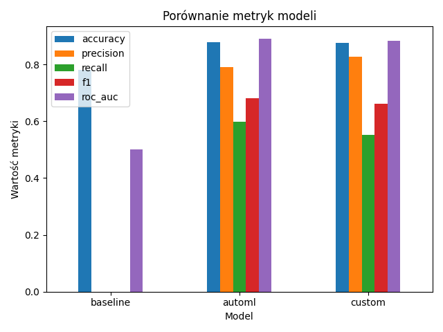

# 📊 Modeling Report -- Credit Scoring

## 1. 🎯 Cel modelowania

Celem etapu modelowania było przygotowanie i porównanie trzech podejść
do predykcji ryzyka kredytowego:

1.  **Model bazowy (Baseline)** -- punkt odniesienia bez prawdziwego
    uczenia.\
2.  **AutoML** -- automatyczny wybór najlepszego modelu na podstawie
    wielu klasyfikatorów.\
3.  **Model własny (Custom)** -- ręcznie skonfigurowany Random Forest.

Modele ocenione zostały na zbiorze walidacyjnym za pomocą metryk:

-   **accuracy**
-   **precision**
-   **recall**
-   **F1-score**
-   **ROC AUC**

------------------------------------------------------------------------

## 2. 📦 Dane wejściowe

Zbiory danych wykorzystane do treningu i walidacji:

-   `data/model_input/train.csv`
-   `data/model_input/val.csv`

Zmienna celu: **`loan_status`**

Do modelowania wybrano wyłącznie kolumny numeryczne.

------------------------------------------------------------------------

## 3. 🧪 Modele

### 3.1. Baseline

Model: `DummyClassifier(strategy="most_frequent")`\
Cel: ustalenie minimalnego poziomu jakości (benchmarku).

------------------------------------------------------------------------

### 3.2. AutoML (AutoML-light)

Użyto trzech klasyfikatorów:

-   Logistic Regression\
-   RandomForestClassifier\
-   GradientBoostingClassifier

Następnie wybrano model **o najwyższym F1-score**.

**Wynik: najlepszy okazał się model AutoML, osiągając F1 = 0.682**

Metryki AutoML:

    {
      "accuracy": 0.8780437896459996,
      "precision": 0.7908415841584159,
      "recall": 0.599437148217636,
      "f1": 0.6819637139807898,
      "roc_auc": 0.8901723368390249
    }

------------------------------------------------------------------------

### 3.3. Model własny (Custom)

Model: `RandomForestClassifier`\
Wybrane hiperparametry:

-   `n_estimators = 300`
-   `max_depth = 8`
-   `min_samples_split = 4`
-   `min_samples_leaf = 2`

Metryki Custom:

    {
      "accuracy": 0.8770206670759157,
      "precision": 0.8260869565217391,
      "recall": 0.5525328330206379,
      "f1": 0.6621697582911749,
      "roc_auc": 0.8837710823910324
    }

------------------------------------------------------------------------

## 4. 📈 Wyniki modeli -- tabela porównawcza

  ------------------------------------------------------------------------------
  Model           Accuracy     Precision     Recall      F1          ROC AUC
  --------------- ------------ ------------- ----------- ----------- -----------
  **Baseline**    0.782        0.000         0.000       0.000       0.500

  **AutoML**      **0.878**    0.791         **0.599**   **0.682**   **0.890**

  **Custom RF**   0.877        **0.826**     0.553       0.662       0.884
  ------------------------------------------------------------------------------

------------------------------------------------------------------------

## 5. 🔍 Interpretacja wyników

### ● Baseline

-   Przewiduje tylko klasę większościową → F1 = 0
-   Służy jako punkt odniesienia → pokazuje, że zadanie nie jest
    trywialne

------------------------------------------------------------------------

### ● AutoML -- ⭐ najlepszy model

-   Najwyższy F1-score (0.682) → **najlepszy kompromis
    precision--recall**
-   Najwyższy ROC AUC (0.890) → najlepsza separacja klas\
-   Wyłapuje najwięcej defaultów (highest recall)

**➡️ Wybrany jako najlepszy model według F1-score**\
(zgodnie z `model_comparison.json`)

------------------------------------------------------------------------

### ● Model własny (RandomForest)

-   Najwyższa precision (0.826) → najmniej fałszywie wykrytych
    defaultów\
-   Niższy recall niż AutoML → bardziej konserwatywny model\
-   Dobry, jeśli biznes preferuje unikanie fałszywych alarmów

------------------------------------------------------------------------

## 6. 📉 Wizualizacje

### 🖼 6.1. Porównanie metryk modeli

Plik: **`docs/plots/metrics_comparison.png`**

------------------------------------------------------------------------

### 🖼 6.2. Ważność cech -- model własny (RandomForest)

Plik: **`docs/plots/feature_importance.png`**

Najważniejsze cechy:

-   **loan_percent_income** -- najwyższy wpływ (35%)\
-   **loan_int_rate**\
-   **person_income**\
-   \*\*\_row_id\*\*\
-   **loan_amnt**

------------------------------------------------------------------------

## 7. 🥇 Wybór najlepszego modelu

Zgodnie z `model_comparison.json`:

    "best_model_by_f1": "automl"

Najlepszy model:\
\### **AutoML (GradientBoosting / RF / Logistic -- wybrany
automatycznie)**

Powody:

-   najwyższy F1\
-   najwyższy ROC AUC\
-   najlepsza detekcja przypadków pozytywnych (default)

------------------------------------------------------------------------

## 8. 📁 Artefakty modelowania

Znajdują się w katalogu:

    data/reporting/
    ├── baseline_metrics.json
    ├── automl_metrics.json
    ├── custom_metrics.json
    ├── automl_results.csv
    └── model_comparison.json

------------------------------------------------------------------------

## 9. 🧭 Wnioski końcowe

-   AutoML dostarcza **najlepszy ogólny model**\
-   Custom RF ma największą precision → dobry dla scenariuszy niskiego
    ryzyka\
-   Preprocessing oraz selekcja cech mają duży wpływ na wyniki\
-   Pipeline modeling działa w pełni w Kedro i generuje kompletne
    artefakty raportowe

------------------------------------------------------------------------

## 10. 📅 Rekomendacje na przyszłość

-   dodać ewaluację na zbiorze testowym,\
-   przeprowadzić analizę błędów (false positives / negatives),\
-   wykorzystać SHAP do interpretacji modelu,\
-   wdrożyć MLflow/WandB do śledzenia eksperymentów.