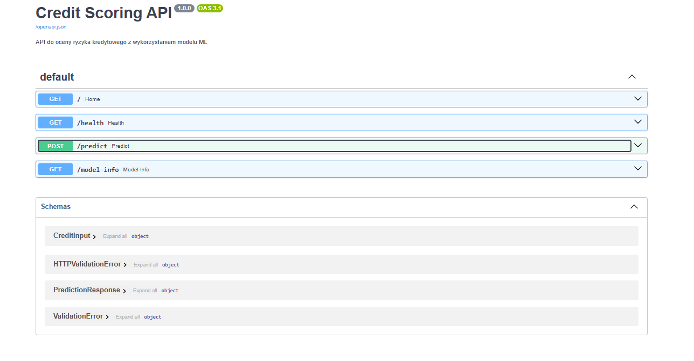
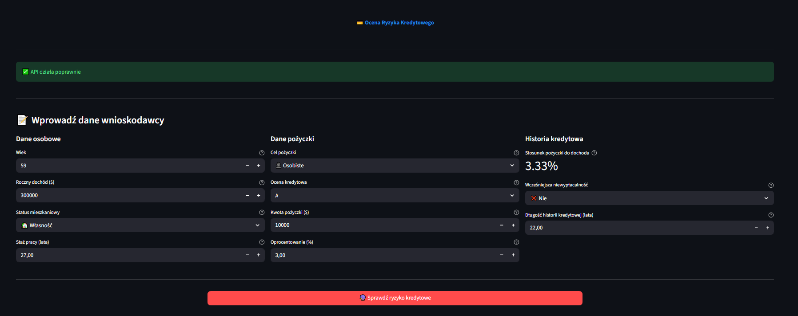
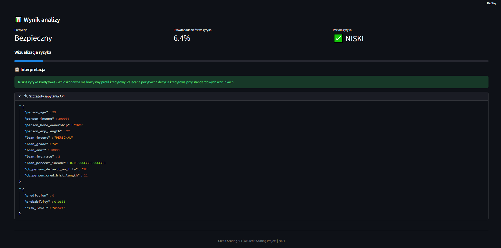

# Credit Scoring Web Application - Raport

## 📋 Przegląd

Aplikacja webowa do oceny ryzyka kredytowego składająca się z:
- **Backend (API)**: FastAPI z pełną integracją preprocessingu
- **Frontend (UI)**: Streamlit z intuicyjnym interfejsem użytkownika


### Przepływ danych

1. Użytkownik wprowadza dane w formularzu Streamlit
2. Frontend wysyła żądanie POST do `/predict`
3. Backend:
   - Waliduje dane wejściowe (Pydantic)
   - Tworzy biny (age_bin, income_bin)
   - Skaluje dane numeryczne (StandardScaler)
   - Wykonuje predykcję modelem ML
4. Frontend wyświetla wynik z interpretacją

---

## 🚀 Uruchomienie aplikacji

### Wymagania

```bash
pip install fastapi uvicorn streamlit requests pandas scikit-learn
```

### 1. Uruchomienie Backend (API)

```bash
uvicorn app.main:app --reload --host 0.0.0.0 --port 8000
```

API będzie dostępne pod adresem:
- Swagger UI: http://localhost:8000/docs
- ReDoc: http://localhost:8000/redoc

### 2. Uruchomienie Frontend (UI)

W nowym terminalu:

```bash
cd e:\Projekty\ASI\ai-credit-scoring
streamlit run frontend/app.py
```

Interfejs będzie dostępny pod: http://localhost:8501

---

## 📡 Endpointy API

### `GET /`
Status API i informacja o załadowanym modelu.

**Odpowiedź:**
```json
{
  "message": "Credit Scoring API działa poprawnie 🚀",
  "model_loaded": true,
  "scaler_fitted": true
}
```

### `GET /health`
Health check endpoint.

**Odpowiedź:**
```json
{"status": "healthy"}
```

### `POST /predict`
Główny endpoint predykcji.

**Żądanie:**
```json
{
  "person_age": 25,
  "person_income": 50000,
  "person_home_ownership": "RENT",
  "person_emp_length": 3.0,
  "loan_intent": "PERSONAL",
  "loan_grade": "B",
  "loan_amnt": 10000,
  "loan_int_rate": 10.5,
  "loan_percent_income": 0.2,
  "cb_person_default_on_file": "N",
  "cb_person_cred_hist_length": 4
}
```

**Odpowiedź:**
```json
{
  "prediction": 0,
  "probability": 0.1234,
  "risk_level": "niski"
}
```

### `GET /model-info`
Informacje o załadowanym modelu.

---

## 🧪 Testy

Uruchomienie testów integracyjnych:

```bash
cd e:\Projekty\ASI\ai-credit-scoring
pytest tests/test_api.py -v
```

Testy obejmują:
- Endpoint główny (`/`)
- Health check (`/health`)
- Predykcję (`/predict`) - poprawne i niepoprawne dane
- Walidację danych wejściowych
- Informacje o modelu (`/model-info`)

---

## 📊 Cechy wejściowe

| Cecha | Typ | Opis | Zakres |
|-------|-----|------|--------|
| `person_age` | int | Wiek wnioskodawcy | 18-90 |
| `person_income` | float | Roczny dochód | ≥ 0 |
| `person_home_ownership` | enum | Status mieszkaniowy | RENT, OWN, MORTGAGE, OTHER |
| `person_emp_length` | float | Staż pracy (lata) | ≥ 0 |
| `loan_intent` | enum | Cel pożyczki | PERSONAL, EDUCATION, MEDICAL, VENTURE, HOMEIMPROVEMENT, DEBTCONSOLIDATION |
| `loan_grade` | enum | Ocena kredytowa | A-G |
| `loan_amnt` | float | Kwota pożyczki | ≥ 0 |
| `loan_int_rate` | float | Oprocentowanie (%) | 0-100 |
| `loan_percent_income` | float | Stosunek pożyczki do dochodu | 0-1 |
| `cb_person_default_on_file` | enum | Czy była niewypłacalność | Y, N |
| `cb_person_cred_hist_length` | float | Długość historii kredytowej (lata) | ≥ 0 |

---

## 📸 Zrzuty ekranu

### Swagger UI (API Documentation)


### Frontend - Formularz


### Frontend - Wynik predykcji


---

## 🔧 Struktura plików

```
ai-credit-scoring/
├── app/
│   └── main.py              # FastAPI backend
├── frontend/
│   └── app.py               # Streamlit frontend
├── data/
│   ├── 02_intermediate/
│   │   └── clean_data.csv   # Dane do dopasowania scalera
│   └── 06_models/
│       └── best_model.pkl   # Wytrenowany model
├── tests/
│   └── test_api.py          # Testy integracyjne
└── docs/
    └── webapp_report.md     # Ta dokumentacja
```

